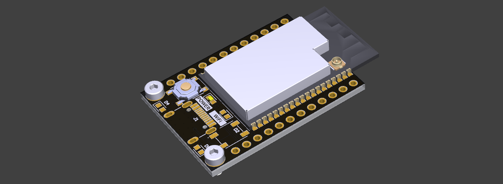

<h1 align="center">
  LevixEduCore
</h1>

<p align="center">
  <b>Librería base para placas Levix Edu con Levix Edu Core</b>
</p>

---

## Tabla de contenido <!-- omit in toc -->
- [Descripción](#descripción)
- [Uso de librería](#uso-de-librería)
  - [Clase heredada (otra librería de alguna placa de desarrollo Levix Edu)](#clase-heredada-otra-librería-de-alguna-placa-de-desarrollo-levix-edu)
  - [Terminal (monitor serial)](#terminal-monitor-serial)
  - [WiFi](#wifi)
  - [Control energía](#control-energía)

---

## Descripción
Esta pequeña librería es la base para otras librerías de placas de desarrollos **Levix Edu**. Es una
abstracción que incluye un control asíncrono del *WiFi* para facilitar su uso, y también algunas
opciones de energía para el reinicio y el modo *deep-sleep*.

## Uso de librería
Esta librería no se puede utilizar sola, ya que es una clase abstracta. Por ende, necesita ser
implementada en otra librería para placa de desarrollo, como
[LevixEduCoreDev]([https://](https://github.com/Creatiox/LevixEduCoreDev)).

Sin embargo, los métodos base se pueden utilizar de la siguiente forma:

### Clase heredada (otra librería de alguna placa de desarrollo Levix Edu)
```cpp
// Lo mínimo que necesita otra clase que derive de LevixEduCore
class LevixEduABC : public LevixEduCore {
  public:
  LevixEduABC() {}

  void init() {
    // Inicializar periféricos, variables, etc.
  }
};

// Crear objeto
LevixEduABC levix;

void setup() {
  // Inicializar Levix
  levix.init();
}
```

### Terminal (monitor serial)
```cpp
void setup() {
  // Inicializar Levix
  levix.init();

  // Utilizar levix.terminal() para acceder al monitor serial
  levix.terminal().println("Hola desde Levix");
}
```

### WiFi
```cpp
#define SSID "ssid"
#define PASS "password"

void onConnect() {
  levix.terminal().println("WiFi conectado!");
}

void onDisconnect() {
  levix.terminal().println("WiFi desconectado!");
}

void setup() {
  // Inicializar Levix
  levix.init();
  
  // Establecer funciones que se ejecuten cuando el WiFi se conecte y desconecte de la red
  levix.wifiOnConnected(onConnect);
  levix.wifiOnDisconnected(onDisconnect);

  // Establecer IP estática
  levix.wifiSetStaticIP(IPAddress(192, 168, 0, 100),
                        IPAddress(192, 168, 0, 1),
                        IPAddress(255, 255, 255, 0),
                        IPAddress(8, 8, 8, 8),
                        IPAddress(8, 8, 4, 4));

  // Establecer IP dinámica
  // levix.wifiSetStaticIP();

  // Habilitar WiFi y conectarse a la red
  levix.wifiEnable(SSID, PASSWORD);
  
  // Deshabilitar WiFi
  // levix.wifiDisable();
}

void loop() {
  if (levix.isWifiConnected()) {
    // Hacer alguna operación si el wifi se encuentra conectado
  }
}
```

### Control energía
```cpp
void setup() {
  // Inicializar Levix
  levix.init();

  // Obtener razones de reinicio y salida modo sleep
  // Valores se encuentran en los enumeradores "esp_*_t"
  esp_reset_reason_t reset        = levix.powerGetResetReason();
  esp_sleep_wakeup_cause_t wakeup = levix.powerGetWakeupReason();

  // Reiniciar Levix
  // levix.restart();
}

void loop() {
  // Esperar 5 segundos y luego activar modo sleep por 5 segundos
  delay(5000);
  levix.powerTimedDeepSleep(5);
}
```